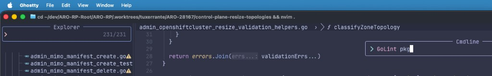
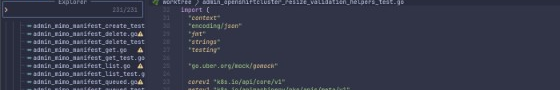
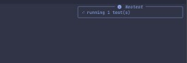

# LazyVim for Go + CopilotChat

This is my public LazyVim setup, tuned for large Go codebases, git worktrees,
and a quieter AI-assisted workflow.

It started from [LazyVim](https://github.com/LazyVim/LazyVim), but the current
customizations are intentionally opinionated around:

- Go development on large monorepos and worktree-heavy repos
- manual, scoped linting instead of aggressive background `golangci-lint`
- visible progress for async test and command workflows
- quieter `CopilotChat.nvim` defaults with safer tool behavior

> Want to try it without replacing your current Neovim setup? Clone it into a
> separate app profile and launch it with `NVIM_APPNAME`.

## At A Glance

- `:GoLint` is manual and scope-aware instead of running on every edit
- `gopls` defaults are curated for large repos
- `neotest` and lint flows surface progress instead of failing silently
- CopilotChat is split into focused read, shell, and edit workflows
- `:CopilotPrepReview` creates a dedicated PR review worktree before collecting
  context
- the top `winbar` stays minimal and only adds a small worktree cue

## Why This Setup Exists

On big Go repos, the default "run everything all the time" editor behavior can
feel heavier than it needs to be:

- `golangci-lint` on `InsertLeave` is too much
- background test and lint commands need visible progress
- AI chat is more useful with read-first defaults and less wall-of-text output
- worktree-heavy flows benefit from subtle context instead of loud UI chrome

The goal here is to keep the editor fast while still making the useful bits easy
to trigger on demand.

## Highlights

### Scoped Go linting

`golangci-lint` is removed from the automatic `nvim-lint` loop for Go buffers.
Instead, there is a manual command:

```vim
:GoLint
:GoLint file
:GoLint pkg
:GoLint repo
```

The default scope is `pkg`, so it stays useful on large repos without
accidentally linting everything.

### Curated `gopls` defaults

The Go LSP config keeps `gopls` enabled, but forces a few defaults that fit
large repos better:

- `gofumpt`, unimported completion, placeholders, and `staticcheck`
- a small set of extra analyses: `nilness`, `unusedparams`, `unusedwrite`, `useany`
- directory filters that skip `.git`, common editor metadata, and `node_modules`

### Progress feedback for tests and lint

`neotest` and `GoLint` both surface start, progress, and completion
notifications instead of disappearing into the background.

For Go tests specifically, `neotest-golang` prefers `gotestsum` when it is
installed and falls back to the standard `go test` runner otherwise.

### Quieter, safer CopilotChat defaults

The `CopilotChat.nvim` workflow is split into focused modes:

- default read/review flow
- explicit shell flow
- explicit edit flow
- optional Caveman post-processing flow

The default tool policy prefers safe repo inspection and avoids dumping full
file contents into chat unless needed.

If `rtk` is on your `PATH`, the explicit shell tools (`bash_safe` / `bash`)
post-process large captured output snapshots before they go back into
CopilotChat. The original command still runs normally first; `rtk` only
compacts oversized output after capture. If `rtk` is not installed, shell mode
still works normally and shows a small one-time install hint for the current
Neovim session.

### PR review prep with a dedicated worktree

There is a review-focused command for seeding the first CopilotChat prompt from
deterministic repo context plus optional GitHub and Jira enrichment:

```vim
:CopilotPrepReview https://github.com/owner/repo/pull/123
```

Use `:CopilotPrepReview!` to refresh the cached bundle. `!` only affects the
collector cache. It does not change repo matching, worktree selection, switch
behavior, or env bootstrap semantics.

`CopilotPrepReview` requires an authenticated GitHub CLI before it starts:
run `gh auth login -h github.com` if needed. It then validates the matching
local repo, creates or reuses a detached `.worktrees/pr-<number>` review
checkout, safely switches the current Neovim session into that worktree,
bootstraps only explicitly allowlisted env symlinks, then collects review
context against the selected worktree before opening CopilotChat.

The prompt is inserted into the current CopilotChat session instead of being
made globally sticky.

See `docs/copilotchat-review-prep.md` for the exact behavior and limitations.

### Minimal worktree-aware top bar

The top `winbar` is intentionally minimal. It no longer duplicates the lower
breadcrumb or statusline; it just shows the filename and a small `worktree`
badge when the current file is under a git worktree.

## Screenshots

### Scoped Go lint from the current package



### Minimal worktree-aware top bar



### Test progress feedback without opening extra panels



## Try It Safely

If you want to try the setup without replacing your current config:

```bash
git clone https://github.com/tuxerrante/dot-config-nvim ~/.config/nvim-tuxerrante
NVIM_APPNAME=nvim-tuxerrante nvim
```

That keeps this config isolated from your main `~/.config/nvim` profile.

If you do want to use it as your main config, clone it into `~/.config/nvim`
instead and start Neovim normally.

LazyVim handles plugin bootstrap on first launch.

## Files Worth Reading First

If you want to copy ideas instead of the whole config, these are the main files
worth reading first:

- `lua/plugins/copilot.lua`
- `lua/copilotchat_runtime.lua`
- `lua/copilotchat_pretty.lua`
- `lua/copilotchat_history.lua`
- `lua/copilotchat_review_prep.lua`
- `scripts/copilot_prep_review.py`
- `lua/plugins/go.lua`
- `lua/plugins/test.lua`
- `lua/plugins/aerial.lua`
- `lua/plugins/typescript.lua`

## Notes For Go Developers

This repo assumes you already have a working Go toolchain. The nicest
experience comes from having these available on your machine:

- `go`
- `gopls`
- `golangci-lint`
- `goimports`
- `gofumpt`
- `gotestsum` (optional; used automatically by `neotest-golang` when available)

## Contributing And Security

Contributor docs live in `CONTRIBUTING.md`, including the disposable test
workflow:

```bash
bash scripts/test-in-disposable-env.sh
```

Security reports should go through `SECURITY.md` and GitHub private
vulnerability reporting, not a public issue.
